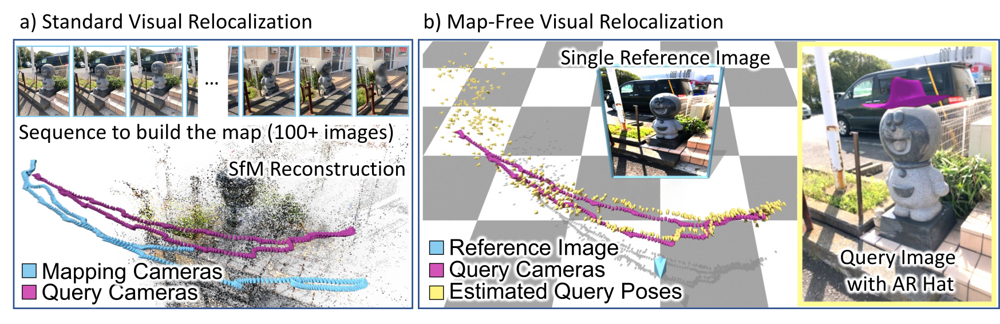

<p align="center">
  <h1 align="center">Map-free Visual Relocalization:<br>Metric Pose Relative to a Single Image</h1>
    <a href="https://earnold.me">Eduardo Arnold</a>
    ·
    <a href="">Jamie Wynn</a>
    ·
    <a href="https://scholar.google.co.uk/citations?user=7wWsNNcAAAAJ">Sara Vicente</a>
    ·
     <a href="https://guiggh.github.io/">Guillermo Garcia-Hernando</a>
    ·
     <a href="https://amonszpart.github.io/">Áron Monszpart</a>
    ·
     <a href="https://www.robots.ox.ac.uk/~victor/">Victor Adrian Prisacariu</a>
    ·
     <a href="https://scholar.google.com/citations?user=ELFm0CgAAAAJ">Daniyar Turmukhambetov</a>
    ·
     <a href="https://twitter.com/eric_brachmann">Eric Brachmann</a>
  </p>
  <h2 align="center">ECCV 2022</h2>
  <h3 align="center"><a href="https://research.nianticlabs.com/mapfree-reloc-benchmark">Project Page</a> | <a href="https://storage.googleapis.com/niantic-lon-static/research/map-free-reloc/MapFreeReloc-ECCV22-paper.pdf">Paper</a> | <a href="https://arxiv.org/abs/2210.05494">arXiv</a> | <a href="https://storage.cloud.google.com/niantic-lon-static/research/map-free-reloc/MapFreeReloc-ECCV22-supplemental.pdf">Supplemental</a> </h3> 
  <div align="center"></div>
</p>

This is the reference implementation of the paper **"Map-free Visual Relocalization: Metric Pose Relative to a Single Image"** presented at **ECCV 2022**.

Standard visual relocalization requires hundreds of images and scale calibration to build a scene-specific 3D map. In contrast, we propose Map-free Relocalization, i.e., using only one photo of a scene to enable instant, metric scaled relocalization.

We crowd-sourced a substantial new [dataset](#camera-map-free-visual-relocalization-dataset) for this task, consisting of 655 places. We also define a new benchmark based on this dataset that includes a public [leaderboard](https://research.nianticlabs.com/mapfree-reloc-benchmark).

<p align="center">
    
</p>

# Overview

1. [Setup](#nut_and_bolt-setup)
1. [Our dataset](#camera-map-free-visual-relocalization-dataset)
1. [Evaluate your method](#bar_chart-evaluate-your-method)
1. [Baselines: Relative Pose Regression](#relative-pose-regression-baselines)
1. [Baselines: Feature Matching + Scale from Estimated Depth](#feature-matching--scale-from-depth-baselines)
1. [Extended Results (7Scenes & Scannet)](#results-on-scannet--7scenes)
1. [Cite](#scroll-cite)
1. [License](#️page_with_curl-license)
1. [Changelog](#pencil-changelog)
1. [Acknowledgements](#octocat-acknowledgements)


# :nut_and_bolt: Setup
Using [Anaconda](https://www.anaconda.com/download/), you can install dependencies with 
```shell
conda env create -f environment.yml
conda activate mapfree
```
We used PyTorch 1.8, PyTorch Lightning 1.6.5, CUDA toolkit 11.1, Python 3.7.12 and Debian GNU/Linux 10.

# :camera: Map-free Visual Relocalization Dataset
We introduce a new [dataset](https://research.nianticlabs.com/mapfree-reloc-benchmark/dataset) for development and evaluation of map-free relocalization. The dataset consists of 655 outdoor scenes, each containing a small ‘place of interest’ such as a sculpture, sign, mural, etc.

To use our code, download [our dataset](https://research.nianticlabs.com/mapfree-reloc-benchmark/dataset) and extract train/val/test.zip files into `data/mapfree`.

## Organization
The dataset is split into 460 training scenes, 65 validation scenes and 130 test scenes.

Each training scene has two sequences of images, corresponding to two different scans of the scene. We provide the absolute pose of each training image, which allows determining the relative pose between any pair of training images.

For validation and test scenes, we provide a single reference image obtained from one scan and a sequence of query images and absolute poses from a different scan.

An exemplar scene contains the following structure:
```
train/
├── s00000
│   ├── intrinsics.txt
│   ├── overlaps.npz
│   ├── poses.txt
│   ├── seq0
│   │   ├── frame_00000.jpg
│   │   ├── frame_00001.jpg
│   │   ├── frame_00002.jpg
│   │   ├── ...
│   │   └── frame_00579.jpg
│   └── seq1
│       ├── frame_00000.jpg
│       ├── frame_00001.jpg
│       ├── frame_00002.jpg
│       ├── ...
│       └── frame_00579.jpg
```

### **intrinsics.txt**
Encodes per frame intrinsics with format 
```
frame_path fx fy cx cy frame_width frame_height
```

### **poses.txt**
Encodes per frame extrinsics with format 
```
frame_path qw qx qy qz tx ty tz
``` 
where $q$ is the quaternion encoding rotation and $t$ is the **metric** translation vector. 

Note:
- The pose is given in world-to-camera format, i.e. $R(q), t$ transform a world point $p$ to the camera coordinate system as $Rp + t$.
- For val/test scenes, the reference frame (`seq0/frame_00000.jpg`) always has identity pose and the pose of query frames (`seq1/frame_*.jpg`) are given relative to the reference frame. Thus, the absolute pose of a given query frame is equivalent to the relative pose between the reference and the query frames.
- We **DO NOT** provide ground-truth poses for the **test** scenes. These are kept private for evaluation in our [online benchmarking website](https://research.nianticlabs.com/mapfree-reloc-benchmark/). The poses provided for test sequences are invalid lines containing 0 for all parameters.
- There might be "skipped frames", i.e. the linear id of a frame does not necessarily correspond to its frame number. 

### **overlaps.npz**
Available for **training scenes only**, this file provides the overlap score between any (intra- and inter-sequence) pairs of frames and can be used to select training pairs. The overlap score measures the view overlap between two frames as a ratio in the interval $[0,1]$, computed based on the SfM co-visibility. Details of how this is computed is available in the [supplemental materials](https://storage.cloud.google.com/niantic-lon-static/research/map-free-reloc/MapFreeReloc-ECCV22-supplemental.pdf).

The file contains two numpy arrays: 
- `idxs`: stores the sequences and frame numbers for a pair of images (A, B), for which the overlap is computed. Format: `seq_A, frame_A, seq_B, frame_B`
- `overlaps`: which gives the corresponding overlap score. 

For example, to obtain the overlap score between frames `seq0/frame_00023.jpg` and `seq1/frame_00058.jpg` one would do:
```
f = np.load('overlaps.npz', allow_pickle=True)
idxs, overlaps = f['idxs'], f['overlaps']
filter_idx = (idxs == np.array((0, 23, 1, 58))).all(axis=1)
overlap = overlaps[filter_idx]
```

Note:
- Although we computed overlap scores exhaustively between any two pairs, we only provide rows for pairs of frames with non-zero overlap score.

## Data Loader
We provide a reference PyTorch dataloader for our dataset in [lib/datasets/mapfree.py](lib/datasets/mapfree.py).

# :bar_chart: Evaluate Your Method 
We provide an [online benchmark website](https://research.nianticlabs.com/mapfree-reloc-benchmark/) to evaluate submissions on the test set.

Note that, for the public leaderboard, **we only allow submissions that use single query frames** for their estimates. That is, methods using multi-frame queries are not allowed. If you are interested in a multi-frame version of the task, please reach out to mapfree-reloc@nianticlabs.com as we might extend the benchmark in the future.

## Submission Format
The submission file is a ZIP file containing one txt file per scene:
```
submission.zip
├── pose_s00525.txt
├── pose_s00526.txt
├── pose_s00527.txt
├── pose_s00528.txt
├── ...
└── pose_s00654.txt
```
Each of the text files should contain the estimated pose for the query frame with the same format as [poses.txt](#posestxt), with the additional `confidence` column: 
```
frame_path qw qx qy qz tx ty tz confidence
```

Note that the evaluation only considers every 5th frame of the query sequence, so one does not have to compute the estimated pose for all query frames. This is accounted for in [our dataloader](lib/datasets/mapfree.py#L173).

## Submission Script
We provide a [submission script](submission.py) to generate submission files:
```shell
python submission.py <config file> [--checkpoint <path_to_model_checkpoint>] -o results/your_method
```

The resulting file `results/your_method/submission.zip` can be uploaded to our [online benchmark website](https://research.nianticlabs.com/mapfree-reloc-benchmark/submit) and compared against existing methods in our [leaderboard](https://research.nianticlabs.com/mapfree-reloc-benchmark/leaderboard).

## Local evaluation
We do **NOT** provide ground-truth poses for the test set. But you can still evaluate your method locally, *e.g.* for hyperparameter tuning or model selection, by generating a submission on the **validation set**
```shell
python submission.py <config file> [--checkpoint <path_to_model_checkpoint>] --split val -o results/your_method
```
and evaluate it on the **validation set** using
```shell
python -m benchmark.mapfree results/your_method/submission.zip --split val
```
This is the same script used for evaluation in our benchmarking system, except we use the test set ground-truth poses.

## Exemples of submissions for existing baselines
You can generate submissions for the [Relative Pose Regression](#relative-pose-regression-baselines) and [Feature Matching](#feature-matching--scale-from-depth-baselines) baselines using
```shell
# feature matching (SuperPoint+SuperGlue), scale from depth (DPT KITTI), Essential Matrix solver
python submission.py config/matching/mapfree/sg_emat_dptkitti.yaml -o results/sg_emat_dptkitti

# feature matching (LoFTR), scale from depth (DPT NYU), PnP solver
python submission.py config/matching/mapfree/loftr_pnp_dptnyu.yaml -o results/loftr_pnp_dptnyu

# relative pose regression model, 6D rot + 3D trans parametrization
python submission.py config/regression/mapfree/rot6d_trans.yaml --checkpoint weights/mapfree/rot6d_trans.ckpt -o results/rpr_rot6d_trans

# relative pose regression model, 3D-3D correspondence parametrization + Procrustes
python submission.py config/regression/mapfree/3d3d.yaml --checkpoint weights/mapfree/3d3d.ckpt -o results/rpr_3d3d
```
You can explore more methods by inspecting [config/matching/mapfree](config/matching/mapfree) and [config/regression/mapfree](config/regression/mapfree).

# Relative Pose Regression Baselines

##  Pre-trained Models
We provide [Mapfree models](https://storage.googleapis.com/niantic-lon-static/research/map-free-reloc/assets/mapfree_rpr_weights.zip) and [Scannet models](https://storage.googleapis.com/niantic-lon-static/research/map-free-reloc/assets/scannet_rpr_weights.zip) for all the RPR variants presented in the paper/supplemental.
Extract all weights to `weights/`. The models name match the configuration files in `config/regresion/`

## Custom Models
One can customize the existing models by changing *e.g.* encoder type, feature aggregation variant, output parametrisation and loss functions. All these hyper-parameters are specified in the configuration file for a given model variant. See *e.g.* [config/regression/mapfree/3d3d.yaml](config/regression/mapfree/3d3d.yaml).

We provide multiple variants for the [encoder](lib/models/regression/encoder), [aggregator](lib/models/regression/aggregator.py) and [loss functions](lib/utils/loss.py).

One can also define a custom model by registering it in [lib/models/builder.py](lib/models/builder.py). Given a pair of RGB images, the model must be able to estimate the metric relative pose between the pair of cameras.

## Training a Model
To train a model, use:
```shell
python train.py config/regression/<dataset>/{model variant}.yaml \
                config/{dataset config}.yaml \
                --experiment experiment_name
```
Resume training from a checkpoint by adding `--resume {path_to_checkpoint}`

The top five models, according to validation loss, are saved during training.
Tensorboard results and checkpoints are saved into the folder `weights/experiment_name`.

# Feature Matching + Scale from Depth Baselines
We provide different feature matching (SIFT, [SuperPoint+SuperGlue](https://github.com/magicleap/SuperGluePretrainedNetwork), [LoFTR](https://github.com/zju3dv/LoFTR)), depth regression ([DPT](https://github.com/isl-org/DPT) KITTI, NYU) and pose solver (Essential Matrix Decomposition, PnP) variants.

One can choose the different options for matching, depth and pose solvers by creating a configuration file in [config/matching/mapfree/](config/matching/mapfree/). 

## Download correspondences and depth files
To reproduce feature matching methods baselines
- Download [DPT estimated depth maps](https://storage.googleapis.com/niantic-lon-static/research/map-free-reloc/assets/mapfree_dpt_depth.tar.gz).
- Download [feature-matching correspondences](https://storage.googleapis.com/niantic-lon-static/research/map-free-reloc/assets/mapfree_correspondences.zip) (LoFTR and SuperPoint+SuperGlue).
- Extract both files to `data/mapfree`

## Custom feature matching method
We provide pre-computed correspondences (SIFT, SuperGlue+SuperPoint and LoFTR) in the path `data/mapfree/{val|test}/{scene}/correspondences_{feature_method}.npz`

To try out your own feature matching methods you need to create a `npz` file storing the correspondences between the reference frame and all query frames for each scene. See steps below:
1. Create a wrapper class to your feature matching method in [etc/feature_matching_baselines/matchers.py](etc/feature_matching_baselines/matchers.py)
2. Add your wrapper into `MATCHERS` in [etc/feature_matching_baselines/compute.py](etc/feature_matching_baselines/compute.py)
3. Execute [etc/feature_matching_baselines/compute.py](etc/feature_matching_baselines/compute.py) using your desired feature matcher on the Mapfree dataset.
4. Create a new configuration file for your feature-matching baseline, *e.g.* modify [config/matching/mapfree/sg_emat_dptkitty.yaml](config/matching/mapfree/sg_emat_dptkitti.yaml) by replacing `SG` in `MATCHES_FILE_PATH` to the name of your matcher.

<details>
<summary> Note on recomputing SG/LoFTR correspondences</summary>

To use SG/LoFTR you need to recursively pull the git submodules using
```shell
git pull --recurse-submodules
```
Then, 
```shell
cd etc/feature_matching_baselines
python compute.py -ds <Scannet or 7Scenes or Mapfree> -m <SIFT or SG or LoFTR>
```
For different 7Scenes pairs variants, include `--pair_txt test_pairs_name.txt`

You also need to download indoor/outdoor weights of LoFTR and extract them to `etc/feature_matching_baselines/weights/`.
</details>

## Custom depth estimation method
We provide estimated **metric depth maps** in `data/mapfree/{val|test}/{scene}/{seq}/frame_{framenum}.dpt{kitti|nyu}.png` (see the [dataset section](#map-free-visual-relocalization))

To try your own depth estimation method you need to provide **metric** depth maps (`png`, encoded in **millimeters**) for each image the the validation/test set.

For example, `data/mapfree/test/s00525/frame_00000.jpg`, will have corresponding depth map `data/mapfree/test/s00525/frame_00000.yourdepthmethod.png`.

To use the custom depth maps, create a new config file, see *e.g.* [config/matching/mapfree/sg_emat_dptkitty.yaml](config/matching/mapfree/sg_emat_dptkitti.yaml), and add the key `ESTIMATED_DEPTH: 'yourdepthmethod'`.

**Externally provided custom depth estimation methods:**
- [KBR depth predictions](https://github.com/jspenmar/slowtv_monodepth#mapfreereloc)

## Custom pose solver
We provide three [pose solvers](lib/models/matching/pose_solver.py): Essential Matrix Decomposition (with metric pose using estimated depth), Perspective-n-Point (PnP) and Procrustes (rigid body transformation given 3D-3D correspondences).

You can add your custom solver to [lib/models/matching/pose_solver.py](lib/models/matching/pose_solver.py) by creating a class that implements `estimate_pose(keypoints0, keypoints1, data)`, where `keypoints` are the image plane coordinates of correspondences and `data` stores all information about the images, including estimated depth maps.

After creating your custom solver class, you need to register it in the [FeatureMatchingModel](lib/models/matching/model.py).

Finally, you can use it by specifying `POSE_SOLVER: 'yourposesolver'` in the configuration file.

# Results on Scannet & 7Scenes
See [this page](benchmark/extended_datasets.md).

# :scroll: Cite
Please cite our work if you find it useful or use any of our code
```latex
@inproceedings{arnold2022mapfree,
      title={Map-free Visual Relocalization: Metric Pose Relative to a Single Image},
      author={Arnold, Eduardo and Wynn, Jamie and Vicente, Sara and Garcia-Hernando, Guillermo and Monszpart, {\'{A}}ron and Prisacariu, Victor Adrian and Turmukhambetov, Daniyar and Brachmann, Eric},
      booktitle={ECCV},
      year={2022},
    }
```

# ️:page_with_curl: License
Copyright © Niantic, Inc. 2022. Patent Pending. All rights reserved. This code is for non-commercial use. Please see the [license file](LICENSE) for terms.

# :pencil: Changelog
- 31/08/2023: updated README.md with externally provdided depthmaps 
- 22/06/2023: updated README.md leaderboard links
- 20/02/2023: benchmark/mapfree.py gives more helpful warnings
- 13/02/2023: updated LICENSE terms

# :octocat: Acknowledgements
We use part of the code from different repositories. We thank the authors and maintainers of the following repositories.
- [CAPS](https://github.com/qianqianwang68/caps)
- [DPT](https://github.com/isl-org/DPT)
- [ExtremeRotation](https://github.com/RuojinCai/ExtremeRotation_code)
- [LoFTR](https://github.com/zju3dv/LoFTR)
- [PlaneRCNN](https://github.com/NVlabs/planercnn)
- [SuperGlue](https://github.com/magicleap/SuperGluePretrainedNetwork)
- [visloc-relapose](https://github.com/GrumpyZhou/visloc-relapose)
